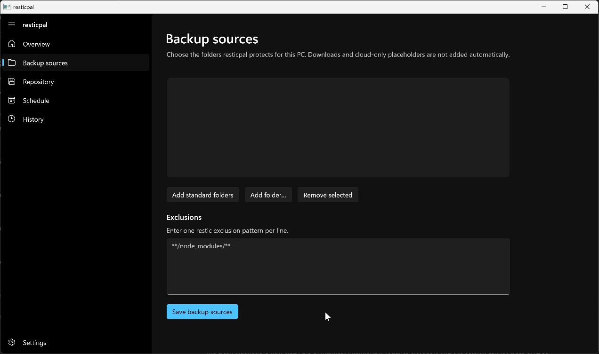
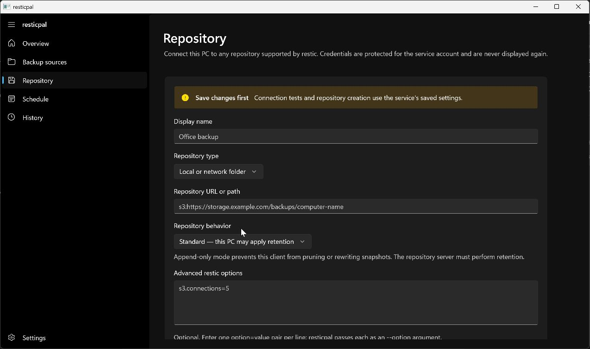
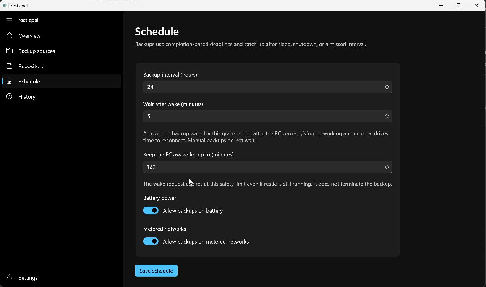

<p align="center">
  
</p>

<h1 align="center">Backups that keep up with your PC.</h1>

<p align="center">
  resticpal turns the trusted <a href="https://restic.net/">restic</a> engine into a quiet,
  friendly Windows backup experience—without hiding the formats or repositories that make restic dependable.
</p>

resticpal protects the files people actually care about while fitting into the way laptops really behave. A small Windows service owns the backup lifecycle, a lightweight tray icon keeps protection status visible, and a native Windows app makes setup understandable.

It is built for personal PCs, small fleets, and managed deployments that want modern Windows ergonomics without giving up restic's backend flexibility.

## Why resticpal

- **Made for sleeping laptops.** Backups catch up after wake, observe a grace period, and hold a bounded Windows wake lock while work is in progress.
- **Protection without an open app.** The machine-wide service continues working when the settings window is closed or no user is signed in.
- **A calm Windows experience.** Native WinUI setup, a low-resource Win32 tray process, useful status, cancellation, and bounded backup history.
- **Your repository, your choice.** Local disks, network shares, S3-compatible storage, REST servers, and the other repositories supported by restic.
- **Ransomware-conscious operation.** Append-only clients can back up but cannot run retention, prune, rewrite, migration, destructive repair, or key removal.
- **Ready to grow from one PC to a fleet.** Local configuration, plain manifest distribution, and signed server enrollment are distinct operating modes rather than an all-or-nothing cloud dependency.

## See it in action

### Pick what matters

Choose folders across local Windows profiles, add custom paths, and keep exclusions readable.



### Bring any restic repository

Connect a local or remote repository, configure S3-compatible storage, and choose standard or append-only maintenance explicitly.



### Work with the laptop, not against it

Control normal cadence, wake grace, wake-lock safety timeout, battery use, and metered-network behavior.



## Three ways to run

**Standalone** keeps configuration and encrypted credentials on the PC. It needs no resticpal account or management service.

**Plain manifest** periodically fetches policy from an ordinary HTTP or HTTPS file server. This mode is deliberately one-way: it does not identify the device, upload status, or bootstrap repository secrets.

**Managed server** fetches independently signed policy documents, keeps a last-known-good policy for offline operation, and sends privacy-bounded device status. A separate `resticpal-server` keeps full repository maintenance credentials so append-only clients never receive the authority needed to delete their backups.

All three policy transport paths now have an end-to-end implementation. One-time enrollment and secret bootstrap are the next management milestone; today a signed-server deployment requires a pre-provisioned protected token reference plus its endpoint, pinned public key, and device ID. See [DESIGN.md](DESIGN.md) for the exact security model and current boundary.

## What works today

- Machine-wide Rust service with startup, resume, power, time-change, and shutdown handling
- Daily/deadline scheduling, wake grace, battery/network gates, retries, and a two-hour wake-lock safety default
- Native Rust/Win32 tray status with run-now and cancellation actions
- On-demand WinUI 3 setup for sources, repository, schedule, status, and backup history
- Typed, per-field managed policy resolution and UI lock enforcement
- Plain HTTP/HTTPS manifests, signed Ed25519 manifests, rollback/freshness checks, and offline last-known-good policy
- Authenticated, bounded device status reporting that cannot make a backup fail
- Local, S3-compatible, REST, and advanced restic repository configuration
- Append-only command authorization enforced before process launch
- DPAPI-encrypted, service-owned credential storage with protected ACLs and opaque references
- Direct restic execution inside a kill-on-close Windows Job Object, bounded JSON progress, and sanitized outcomes
- Durable repository validation, scheduler state, and privacy-bounded SQLite run history
- Per-machine x64 MSI with a virtual service account, recovery policy, tray startup, bundled restic, and data-preserving uninstall
- Optional companion server for signed manifests, latest-device status, and server-only retention/prune jobs

## The append-only model

An append-only client should be able to add a new backup without being able to erase yesterday's good copy. resticpal enforces that distinction in its command builder and expects the storage layer—IAM policy, rest-server, proxy, object lock, or equivalent—to enforce it too.

Retention for such repositories belongs on a separate, better-protected host. The companion server uses different full-access credentials to apply time-window-aware snapshot retention and prune unreferenced pack data. Those credentials are never delivered to enrolled backup clients.

## Project status

resticpal is early alpha software. The core backup path, native UI, tray, protected configuration, local history, append-only restrictions, managed policy/status transport, companion maintenance server, MSI authoring, and real-restic test harnesses are in place. Production qualification across the supported Windows 10/11 matrix, one-time enrollment, secret bootstrap, update UX, and graceful-first cancellation remain in progress.

The source of truth for requirements, trust boundaries, implementation status, and open decisions is [DESIGN.md](DESIGN.md).

## Build and test

Development currently uses Rust 1.97, .NET SDK 10.0.302, the Windows App SDK, and WiX 6.

```powershell
cargo fmt --all -- --check
cargo test --workspace
cargo clippy --workspace --all-targets -- -D warnings
dotnet build ResticPal.slnx --configuration Debug
```

Exercise a disposable real local repository without VSS elevation:

```powershell
.\scripts\Test-LocalRestic.ps1
```

Use `-UseVss` from an elevated shell to test the exact production snapshot path. Build and inspect the development installer with:

```powershell
.\scripts\Build-Installer.ps1
.\scripts\Test-InstallerPackage.ps1
```

The elevated `.\scripts\Test-InstalledResticPal.ps1` harness installs the MSI only when it can prove there is no pre-existing resticpal installation or data directory, exercises the production service and local repository lifecycle, verifies data-preserving uninstall, and removes only its own synthetic state.

## For contributors

- `crates/resticpal-core` — policy, scheduling, status, and restic command rules
- `crates/resticpal-protocol` — versioned, bounded local IPC contracts
- `crates/resticpal-windows` — Windows named pipes, DPAPI, and profile discovery
- `apps/resticpal-service` — machine-wide Windows service
- `apps/resticpal-tray` — low-resource notification-area host
- `apps/ResticPal.UI` — on-demand WinUI application
- `installer` — per-machine WiX MSI
- `scripts` — acquisition, packaging, local-repository, and installed-service tests

Security-sensitive contributions should preserve the service execution boundary, typed command allowlists, secret redaction, bounded inputs, append-only denial matrix, and explicit separation between client and server repository credentials.

## License

BSD 2-Clause. Copyright (c) 2026 Yann Ramin. See [LICENSE](LICENSE).
